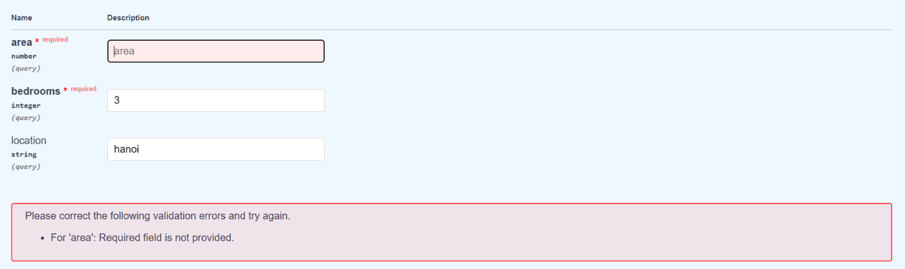

# House Price Prediction App

A simple web application that predicts house prices based on area, bedrooms, and location using FastAPI (backend) and HTML/JS (frontend).

## How to Run the Project
To run this project locally, follow these steps in order:

1. Navigate to the backend directory containing the `main.py` file:
   `cd backend`
2. Start the FastAPI local server:
   `uvicorn main:app --reload`
3. Open your web browser and visit:
   `http://127.0.0.1:8000/` (or `http://127.0.0.1:8000/static/house_form.html` depending on your root route configuration).

## Task 3: API Testing and Parameter Validation
* **JSON Response for area=80, bedrooms=3, location=hanoi:**

* **Why calling `/predict` without `location` still works:** 
  In the `main.py` file, the `location` parameter is defined with a default value (`location: str = "others"`)[cite: 5]. FastAPI recognizes this default assignment, making the query parameter optional. If the client does not provide a location in the URL, FastAPI automatically injects the string "others" into the function, allowing the execution to proceed normally.
* **Why calling `/predict` without `area` returns a 422 error:**
  The `area` parameter is defined simply as `area: float` without any default value assigned[cite: 5]. FastAPI interprets this as a strictly required query parameter. When the request omits it, FastAPI's built-in Pydantic validation intercepts the request before it even reaches the function logic and automatically returns an HTTP 422 (Unprocessable Entity) error to inform the client that required data is missing.

## Task 5: Why does a relative URL work for the `/predict` endpoint?
A relative URL works here because both the frontend interface and the backend API are served by the exact same FastAPI server (`http://127.0.0.1:8000`). When the browser encounters `fetch('/predict')`, it automatically prepends the current origin's protocol, domain, and port to the request, accurately routing it to the absolute URL without us needing to hardcode it.